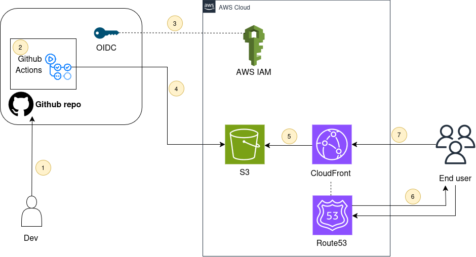

# AWS Static Website Hosting with CI/CD Pipeline

Dự án triển khai Portfolio cá nhân sử dụng các dịch vụ Cloud hiện đại của AWS, đảm bảo tiêu chí: **Tốc độ cực nhanh - Bảo mật tuyệt đối - Chi phí tối ưu**.

## 🏗 Kiến trúc hệ thống (Architecture)

Hệ thống được thiết kế theo mô hình kiến trúc serverless hiện đại:
1. **GitHub Actions**: Bộ máy tự động hóa CI/CD.
2. **IAM OIDC**: Phương thức xác thực không dùng mật khẩu (Keyless) giữa GitHub và AWS.
3. **Amazon S3**: Lưu trữ mã nguồn website tại Singapore (ap-southeast-1).
4. **Amazon CloudFront**: Mạng phân phối nội dung (CDN) toàn cầu với HTTPS.
5. **Origin Access Control (OAC)**: Đảm bảo chỉ CloudFront mới có quyền truy cập S3.
6. **Amazon Route 53**: Quản lý DNS và trỏ tên miền về hệ thống.

---

## 🚀 Tính năng nổi bật

- **⚡ Fast Performance**: Sử dụng CloudFront CDN với các Edge Location tại Singapore giúp website tải gần như tức thì tại Việt Nam.
- **🛡️ Enhanced Security**: 
    - Chứng chỉ SSL/TLS miễn phí từ **AWS Certificate Manager (ACM)**.
    - Chặn hoàn toàn truy cập Public vào S3 Bucket thông qua **OAC**.
- **🤖 Modern CI/CD**: Sử dụng **OpenID Connect (OIDC)** để loại bỏ việc lưu trữ AWS Access Keys trên GitHub, hạn chế rủi ro rò rỉ thông tin.
- **💰 Cost Effective**: Tận dụng tối đa AWS Free Tier (S3, CloudFront).

---

## 🛠 Hướng dẫn triển khai nhanh (Quick Start)

Nếu bạn muốn clone dự án này, hãy đảm bảo đã cấu hình các thành phần sau trên AWS:

1. **S3 Bucket**: Tạo bucket và chặn Public Access.
2. **ACM Certificate**: Tạo chứng chỉ SSL tại vùng `us-east-1`.
3. **CloudFront**: Tạo Distribution, cấu hình OAC và gắn chứng chỉ SSL.
4. **IAM Role**: Tạo Role cho GitHub Actions với Trust Policy giới hạn đúng repository của bạn.
5. **Route 53**: Tạo bản ghi Alias A trỏ về CloudFront domain.

Tại Repository GitHub, hãy đảm bảo file `.github/workflows/deploy.yml` đã được cập nhật đúng **Role ARN** và **CloudFront Distribution ID**.

---

## 📈 Kết quả
Trải nghiệm trực tiếp tại: [truongtudev.id.vn](https://truongtudev.id.vn)

---
*Dự án thuộc Project 1 trong lộ trình AWS Learning Curriculum.*